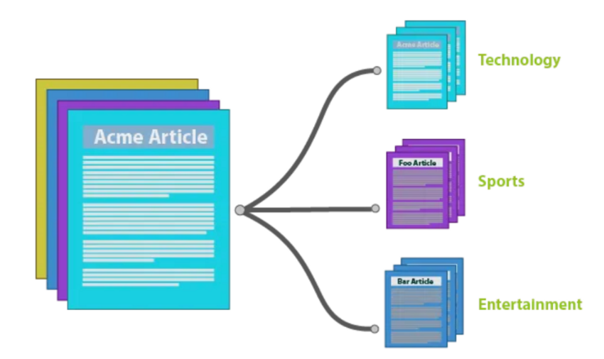
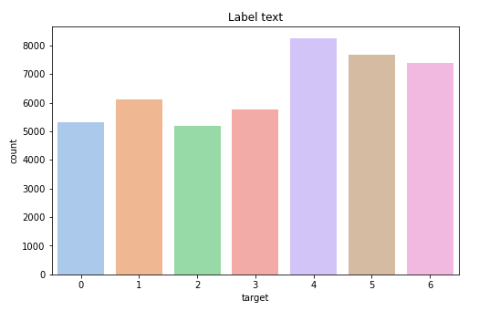
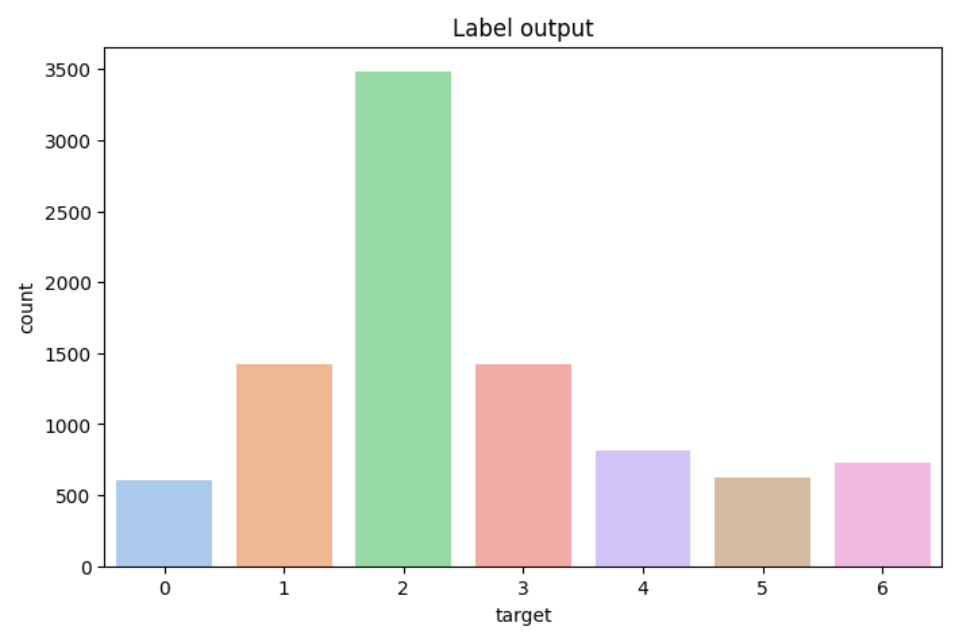
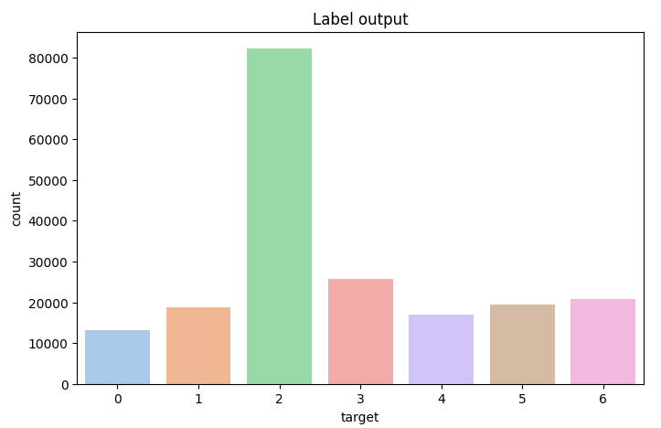

  <h1> 주제 분류 프로젝트 </h1>
  
 모델 구조의 변경 없이 Data-Centric 관점으로 텍스트의 주제를 분류 

<table>
    <tr height="160px">
        <td align="center" width="150px">
            
             
            <strong>지은</strong>
        </td>
        <td align="center" width="150px">
            
             
            <strong>재연</strong>
        </td>
        <td align="center" width="150px">
            
             
            <strong>영준</strong>
        </td>
        <td align="center" width="150px">
            
             
            <strong>다혜</strong>
        </td>
            <td align="center" width="150px">
            
             
            <strong>윤진</strong>
        </td>
    </tr>
<table>

# 1. 프로젝트 개요

## 1.1 개요

자연어를 독해 및 분석 과정을 거쳐 주어진 태스크를 수행하기 위해서는 자연어의 주제에 대한 이해가 필수적입니다. **Topic Classification task**는 모델이 자연어를 잘 이해하고 있는지 평가할 수 있는 가장 간단한 task입니다.

그 중에서도 KLUE-Topic Classification benchmark는 뉴스의 헤드라인을 통해 그 뉴스가 어떤 topic을 갖는지를 분류해내는 task입니다. 각 자연어 데이터에는 생활문화(Society), 스포츠(Sports), 세계(World), 정치(Politics), 경제(Economy), IT과학(IT/Science), 사회(Society) 등 다양한 주제 중 하나가 라벨링 되어 있습니다.

본 대회는 결과물 csv 확장자 파일을 제출하게 됩니다.

- **input :** 약 9100개의 뉴스 헤드라인과 url, 작성 날짜
- **output** : 각 뉴스 헤드라인의 주제 (생활문화, 스포츠, 세계, 정치, 경제, IT과학, 사회 중 하나)

**Data-Centric** 의 취지에 맞게, 베이스라인 모델의 수정 없이 오로지 데이터의 수정으로만 성능 향상을 이끌어내야 합니다. **베이스라인 코드의 수정이 없는 선에서, 모든 방법을 적용할 수 있습니다.**

# 2. 프로젝트 팀 구성 및 역할

- 권지은 - RoBERTa soft voting 및 Cleanlab을 이용한 라벨 노이즈 제거
- 김재연 - KoGPT를 활용한 증강, URL 크롤링으로 G2P 노이즈 제거
- 박영준 - RoBERTa를 이요한 라벨 노이즈 제거
- 정다혜 - 외부데이터 Self Training Method적용
- 최윤진 - koEDA를 이용한 증강, 프롬프팅 증강

# 3. 프로젝트 수행 결과

## 3-1. 학습 데이터 소개

KLUE 공식 사이트에서 제공하는 KLUE-TC(YNAT) 데이터셋과 같은 포맷을 가집니다. 

제공되는 총 학습 데이터는 45,678개(train*test* split을 거친 후의 train data는 31,974개, evaluation dataset는 13,704개)이며, 테스트 데이터는 9,107개 입니다.

기존 KLUE-YNAT 학습 데이터셋에 noise가 섞인 데이터가 일부 섞여있습니다.

노이즈 데이터의 경우 전체 학습 데이터의 15%(총 6,852개)에 해당합니다. noise data 중 80%(5,481개)는 G2P를 이용한 text perturbation으로 생성되었으며, 
prescriptive pronunciation과 descriptive pronunciation을 1:1 비율로 사용하여 noise를 생성하였습니다. 

나머지 20%(1,371개)는 labeling 오류로 만들어진 데이터 입니다.

- 데이터 예시

| ID | text | target | url | date |
| --- | --- | --- | --- | --- |
| ynat-v1_train_00000 | 유튜브 내달 2일까지 크리에이터 지원 공간 운영 | 3 | https://news.naver.com/main/read.nhn?mode=LS2D&mid=shm&sid1=105&sid2=227&oid=001&aid=0008508947 | 2016.06.30. 오전 10:36 |
| … | … | … | … | … |
| ynat-v1_train_45677 | 극적 역전승 도로공사 GS칼텍스 꺾고 2년 연속 챔프... | 5 | https://sports.news.naver.com/news.nhn?oid=001&aid=0010704877 | 2019.03.19 21:32 |

## 3-2. EDA

target data인 label 분포는 다음과 같으며, 불균형을 확인할 수 있다. 특히, 사회(2)데이터가 가장 적음을 확인하였다.

## 3-3. 데이터 증강

### 3-3-1. AI Hub 외부 데이터셋 ‘뉴스 기사 기계독해 데이터’ 활용

target에 실제 뉴스기사의 주제가 아닌 **annotator들의 labeling을 반영**하기 위해 **Self Training Method**를 적용하여 외부 데이터에 대하여 labeling을 진행하였다.

**Self Training Method에서 Ensemble에 사용한 model은 다음과 같다.**

roberta-large / xlm-roberta-large / kobert / kobart

| Train data | f1 | accuarcy |
| --- | --- | --- |
| 외부데이터셋 추가 전 | 0.8778 | 0.8733 |
| 외부데이터셋 추가 후 | 0.8787(0.009△) | 0.8766(0.033△) |

추가로, 증강한 train data에서 사회 label이 약 70%를 차지하였고, output에서 2(사회)를 많이 예측함을 발견하여 사회데이터에 대하여 sampling을 진행한 실험 결과, sampling을 하지 않는 것이 가장 우수한 성능을 보였다.

output에서 2(사회)를 많이 예측함을 발견하였다.

사회데이터에 대하여 0.6만큼 sampling을 적용하였다.

| Train data | f1 | accuarcy |
| --- | --- | --- |
| 사회 label 전체 추가 | 0.8787 | 0.8733 |
| 사회 label 0.6만큼만 추가 | 0.8735 | 0.8735 |
| 사회 label 0.3만큼만 추가 | 0.8517 | 0.8597 |

### 3-3-2. KoGPT를 활용한 증강

(1) skt/ko-gpt-trinity-1.2B-v0.5를 베이스모델로 모든 라벨에 대해서 기존 데이터셋 학습

- 학습 데이터 예시
    
    
    | 스포츠 | 남자농구 월드컵 예선 2R 한국시리아전 내달 17일 고양 개최 |
    | --- |
    | 정치 | 문 대통령 개헌안 준비하라 ... 국회 합의만 기다릴 상황 아냐 |
    | 경제 | 코스피 외국인 팔자에 나흘째 하락 ... 2320대에 묶여 |
- 입출력 예시
    
    
    | IT과학 | 네이버 앱 내 사용자 평점 공개...자사 서비스 홍보나선다 |
    | --- | --- |
    | 스포츠 | 프로야구 삼성의 첫 대결...SK 두산 꺾고 SO리그 4연패 탈출 |
    | 사회 | 특검 최순실 특검 공식 수사착수...수사대상은 박 대통령``종합2보 |

 → 다른 라벨의 텍스트가 생성되는 문제 발생

(2) skt/kogpt2-base-v2를 베이스모델로 7개의 라벨에 대해서 따로 학습

- 실험 결과
    
    
    |  | f1 | accuracy |
    | --- | --- | --- |
    | 원본 | 0.8720 | 0.8698 |
    | (1)로 생성한 7만 문장 | 0.7020 | 0.6877 |
    | (2)로 생성한 3.5만 문장 | 0.8305 | 0.8291 |

### 3-3-3. EDA(Easy Data Augmentation)

koeda 라이브러리를 이용하여 동의어 교체, 무작위 삽입, 무작위 삭제, 무작위 위치 교체 옵션

*monologg/koelectra-base-discriminator* 를 이용하여 유사도 0.92~0.7인 텍스트를 추가

- 실험
    1. 데이터 선별 없이 300개 증강
    2. 학습한 모델에 다시 학습 데이터를 넣어서 잘못 예측한 데이터 한해 EDA 를 적용하여 유사 데이터를 추가하는 방식으로 400개 증강
    3. 2번과 같은 방식으로 5200개
- 결과
    
    데이터의 품질이 좋지 못했지만 잘 틀린 데이터에 대해서 정답을 한 번 더 알려주는 효과
    
    |  | f1 | accuracy | 해석 |
    | --- | --- | --- | --- |
    | 1 | 0.8733 → 0.8557 | 0.8752 → 0.8614 | over-fitting |
    | 2 | 0.8769 → 0.8602 | 0.8779 → 0.8639 | 유의미한 향상 |
    | 3 | 0.8753 → 0.8587 | 0.8750 → 0.8647 | over-fitting |

### 3-3-4. 프롬프팅(Prompting)

생성 AI(chatGPT 3.5, Bard, wrtn)에 프롬프팅을 사용하여 텍스트 생성

<aside>
💡 **프롬프트 예시**
뉴스 주제 분류 딥러닝 모델을 만들려고 하는데, 사회 기사 제목을 생성해주세요.
 (추가) 문장의 길이는 기사 200자 이상으로 해주세요.

입력한 텍스트와 유사한 문장을 생성해주세요.

</aside>

|  | 문장 | 정답 | 예측 |
| --- | --- | --- | --- |
| 1 | 무약정폰가격 담합 조사해 달라...
녹소연공정위에 신고 | 경제 | 사회 |
| 2 | 서울역 이태원에 관광버스 주차장 생긴다 | 생활문화 | 사회 |
| 3 | 성윤모장관 부산지역 조선기자재업계와 간담회 | 정치 | 사회 |

사회 라벨에 오차가 많이 발생하여 자연스럽게 경계선에 있을거라 예상되는 데이터를 의도적으로 증강

경계선에 있는 문장들에 대한 의도적 증강

**최종 프롬프트** : “정치” 기사 제목처럼 보이지만 “사회” 기사인 것 생성해주세요.

- 실험
    1. 혼동 행렬상 오차가 많은 부분에 대해서 600개 증강
    2. “사회” 기사 제목처럼 보이지만 “정치” 기사인 데이터 200 개 추가
    3. “정치” 기사 제목처럼 보이지만 “사회” 기사인 데이터 200 개 추가
- 결과
    
    
    |  | f1 | accuracy |
    | --- | --- | --- |
    | 1 | 0.8710 → 0.8573 | 0.8704 → 0.8606 |
    | 2 | 0.8705 → 0.8600 | 0.8702 → 0.8614 |
    | 3 | 0.8732 → 0.8567 | 0.8724 → 0.8617 |

## 3-4. G2P 노이즈 처리

### 3-4-1. URL 크롤링

- 학습데이터에 포함된 url와 newspaper 라이브러리를 사용하여 기사 제목 크롤링 후 텍스트 재설정
    
    
    |  | f1 | accuracy |
    | --- | --- | --- |
    | 원본 | 0.8720 | 0.8698 |
    | 재설정 | 0.8759 | 0.8755 |

## 3-5. 라벨 노이즈 처리

### 3-5-1. RobERTa 분류기 학습

- 가설 : Train data 의 라벨 노이즈는 전체 데이터의 3%( 약 1400 개)로 크지 않은 비율이다. Train data를 가지고 KLUE의 RoBERTa-large 모델을 fine-tuning 시킨 후, 다시 train data 를 모델에 넣었을 때 기존 라벨과 예측 라벨이 다른 데이터가 있다면 이 데이터는 라벨 노이즈가 있는 데이터라고 판단할 수 있을 것이다.
- 실험1: 단일 분류기
    - 결과
        
        약 4000개의 데이터가 라벨이 달라졌고, 달라진 데이터를 삭제 / 수정을 한 뒤 실험을 각각 진행했다. 삭제했을 때 성능이 크게 좋아지진 않았지만, 삭제하면서 학습을 방해하는 노이즈가 사라졌다고 판단
        
        |  | f1 | accuracy |
        | --- | --- | --- |
        | 기존 | 0.8759 | 0.8755 |
        | 삭제 | 0.8778 | 0.8733 |
        | 수정 | 0.8717 | 0.8695 |
- 실험2: Soft Voting Ensemble
    
    Stratified Kfold(k=5)로 학습 데이터, 테스트 데이터를 나눴다. 각 폴드마다 학습 데이터를 Stratified Kfold(k=3)로 분리하고, 서로 다른 데이터셋으로 klue/roberta-large 모델 3개를 학습시켰다. 테스트 데이터에 대해 각 모델이 생성한 예측 확률을 평균 내어서 최종 예측 라벨을 생성했다. 최종 예측 라벨과 기존 라벨이 같지 않은 데이터를 ********************삭제********************했다.
    

### 3-5-2. Cleanlab

- 모델이 예측한 라벨 별 확률을 이용해서 기존 라벨의 quality score 계산 후 라벨의 quality score 가 특정 기준을 넘지 못하는 데이터 제거
- 결과 : 기존 데이터보다 필터링한 데이터를 사용했을 때 점수가 떨어졌다. Soft voting 으로 예측한 라벨과 기존 라벨을 비교하는 방식보다 라벨 노이즈를 더 잘 잡아냈다.
    
    
    |  | f1 | accuracy |
    | --- | --- | --- |
    | 기존 | 0.8629 | 0.8687 |
    | soft voting | 0.8503 | 0.8538 |
    | CleanLab | 0.8599 | 0.8647 |